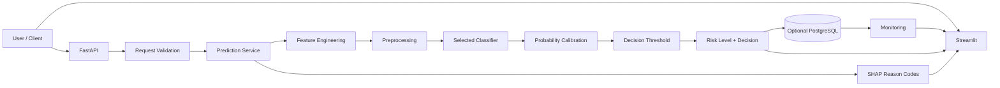

# Real-Time Transaction Fraud Risk & Monitoring Platform

> An end-to-end machine learning portfolio project for transaction fraud-risk scoring, calibrated probability estimation, cost-sensitive decisioning, explainability, API inference, interactive analysis, monitoring, and optional prediction-event persistence.


## Why this project exists

Fraud detection is not only a binary-classification problem. A practical scoring system must also deal with:

- a rare positive class;
- changing transaction behavior over time;
- the business cost of false positives and false negatives;
- probability quality, not only class labels;
- operational decision thresholds;
- explainability for analysts;
- model and data monitoring after release.

This repository is structured as an ML engineering project rather than a notebook-only exercise. Reusable pipeline logic lives under `src/`, while the API, dashboard, tests, SQL, notebooks, reports, and documentation are separated by responsibility.

## 🎥 Demo

## 🚀 Live Demo
👉 https://real-time-fraud-risk-platform.streamlit.app/

> Interactive portfolio/research demo. This project is not a production banking fraud system.

## 🎥 Demo Screenshots

The following screenshots showcase the major components of the platform:

```text
docs/
└── images/
    ├── dashboard.png
    ├── prediction.png
    ├── monitoring.png
    └── api.png
```

Recommended captures:

1. **dashboard.png** — overview page with the major sections visible.
2. **prediction.png** — one transaction score showing probability, risk level, decision, threshold, and reason codes.
3. **monitoring.png** — the actual monitoring view generated by the current code and data.
4. **api.png** — FastAPI interactive documentation with the important inference routes visible.

After those files exist, place the strongest prediction screenshot near the top of this README.

## 🎯 Problem

Fraudulent transactions are typically much rarer than legitimate transactions, so accuracy alone can hide poor fraud detection. Blocking too aggressively also harms legitimate customers. A useful system therefore needs calibrated risk probabilities, a defensible decision threshold, explainability, and monitoring—not just a classifier.

## 💡 Solution

The implemented ML path is designed around temporal separation and a staged validation process:

```text
IEEE-CIS transaction data
        ↓
Data loading + validation
        ↓
Feature engineering
        ↓
Preprocessing
        ↓
Temporal train / validation / test split
        ↓
Candidate model training
        ↓
Probability calibration
        ↓
Business-cost threshold selection
        ↓
Frozen-threshold holdout evaluation
        ↓
Saved model artifacts
        ↓
Prediction CLI / FastAPI
        ↓
Streamlit + monitoring
        ↓
Optional PostgreSQL integration
```

The validation period is further separated so that probability calibration and threshold selection do not use the final held-out test set.

## ✨ Key Features

- **IEEE-CIS fraud-classification workflow**
- **Temporal validation** instead of careless random holdout selection
- **Reusable scikit-learn pipeline** combining feature engineering, preprocessing, and estimator
- **Candidate model comparison** across Logistic Regression, LightGBM, and XGBoost when available
- **Validation PR-AUC model selection**
- **Probability calibration**
- **Cost-sensitive threshold optimization**
- **LOW / MEDIUM / HIGH risk levels**
- **Fraud probability + decision + threshold + model version output**
- **SHAP-based top reason codes**
- **FastAPI inference service**
- **Batch-scoring route module**
- **Streamlit multi-page application**
- **Dedicated monitoring modules with configurable PSI thresholds**
- **Optional Evidently integration**
- **Optional PostgreSQL integration and SQL assets**
- **Automated pytest suite structure**
- **GitHub Actions workflow files for test/lint automation**
- **Windows-first local workflow**
- **Separate notebooks, reports, source modules, tests, and documentation**

## 🏗️ Architecture



The core prediction path can run from saved artifacts without requiring the optional persistence layer.

## 🧰 Technology Stack

| Layer | Technology | Purpose |
|---|---|---|
| Language | Python | Core application and ML engineering |
| Data | pandas, NumPy | Data loading and transformation |
| ML pipeline | scikit-learn | Pipeline composition and baseline modeling |
| Gradient boosting | LightGBM, XGBoost | Candidate fraud classifiers |
| Explainability | SHAP | Global plots and per-prediction reason codes |
| API | FastAPI, Pydantic, Uvicorn | Validated REST inference service |
| Dashboard | Streamlit, Plotly | Interactive scoring and monitoring UI |
| Monitoring | Custom monitoring modules, Evidently optional | Drift/monitoring workflow |
| Database | PostgreSQL, SQLAlchemy | Optional persistence and SQL analytics |
| Testing | pytest | Automated tests |
| CI | GitHub Actions | Repository validation workflows |

## 🧠 Machine Learning Pipeline

### 1. Data loading and validation

The training entry point calls a reusable data loader and validation layer before modeling. Duplicate transaction IDs are handled and rows missing the target, transaction time, or transaction amount are removed before the temporal split.

### 2. Leakage-aware feature pipeline

Each candidate estimator is wrapped in a scikit-learn `Pipeline`:

```text
Raw transaction row
    ↓
FraudFeatureEngineer
    ↓
Preprocessor
    ↓
Estimator
```

This makes feature and preprocessing fitting part of the training pipeline instead of a separate full-dataset preprocessing step.

### 3. Temporal validation

The training data is separated chronologically into train, validation, and test partitions. The validation portion is then split again:

```text
Training period
    ↓
Fit model

Calibration portion
    ↓
Fit probability calibrator

Threshold portion
    ↓
Optimize decision threshold

Final holdout
    ↓
Evaluate selected model with frozen threshold
```

This is an important design choice: the final holdout is not used to choose the model or tune the decision threshold.

### 4. Candidate models

The training code supports:

- Logistic Regression baseline
- LightGBM
- XGBoost

LightGBM is configured with balanced class weighting. Candidate availability is handled gracefully when an optional modeling package is unavailable.

### 5. Model selection

Candidate models are compared using **validation PR-AUC**. The highest validation PR-AUC candidate becomes the selected model for that training run.

The final holdout remains an evaluation set rather than a second model-selection set.

### 6. Probability calibration

Raw model probabilities are passed through a calibration stage fitted on a dedicated calibration subset. This matters because downstream fraud decisions use probability thresholds and business costs.

### 7. Cost-sensitive threshold selection

Threshold optimization uses configurable false-positive, false-negative, and manual-review costs. The selected threshold is fitted on the threshold-selection subset and then frozen for final holdout evaluation.

### 8. Saved artifacts

A completed training run writes the artifacts needed for inference:

```text
models/
├── model.joblib
├── preprocessor.joblib
├── calibrator.joblib
├── threshold.json
├── feature_schema.json
└── model_metadata.json
```

The preprocessing object is also embedded in the main model pipeline.

## 🤖 Model Results

The repository contains generated report locations for model comparison and holdout evaluation:

```text
reports/metrics/model_comparison.csv
reports/metrics/selected_test_metrics.json
reports/metrics/verified_training_metadata.json
reports/metrics/full_candidate_results.json
```

This README intentionally does **not** hard-code numerical model results that have not been revalidated against the current branch and environment.

Before publishing metrics in the GitHub hero section, rerun the current pipeline and copy only values produced by that run.

## 🔍 Model Explainability

The prediction layer can return the top three SHAP-derived reason codes for each scored transaction.

```text
Transaction
    ↓
Feature pipeline
    ↓
Fraud classifier
    ↓
Calibrated prediction
    ↓
SHAP explanation
    ↓
Top reason codes
```

The training path also writes:

```text
reports/figures/shap_summary.png
reports/figures/shap_feature_importance.png
reports/figures/shap_individual_transaction.png
```

The dashboard should present human-readable reasons rather than overwhelming a non-technical user with raw attribution values.

## 🔌 REST API

Start the API from the repository root:

```powershell
uvicorn api.main:app --reload --host 127.0.0.1 --port 8000
```

Interactive documentation:

```text
http://localhost:8000/docs
```

The repository contains dedicated route modules for health checks, single prediction, batch scoring, and monitoring. Before publishing a permanent endpoint table, confirm the exact decorators in the current `api/routes/` files.

The core prediction contract produced by the scoring layer contains:

```json
{
  "transaction_id": null,
  "fraud_probability": "<0-to-1 probability>",
  "prediction": "<0-or-1>",
  "risk_level": "<LOW | MEDIUM | HIGH>",
  "decision": "<decision label>",
  "threshold": "<saved decision threshold>",
  "model_version": "<artifact model version>",
  "reason_codes": ["<reason 1>", "<reason 2>", "<reason 3>"],
  "prediction_timestamp": "<UTC ISO-8601 timestamp>"
}
```

A minimal transaction can be scored using `TransactionAmt`; the saved feature schema aligns optional raw fields used by the fitted pipeline.

## 📊 Interactive Dashboard

Start the application from the repository root:

```powershell
streamlit run app/streamlit_app.py
```

The current repository is organized into these dashboard pages:

```text
app/pages/
├── overview.py
├── transaction_scoring.py
├── model_performance.py
└── monitoring.py
```

The UI should be used to demonstrate:

- transaction input;
- calibrated fraud probability;
- risk level and final decision;
- selected threshold;
- model metadata;
- reason codes;
- model-performance reports generated by the training run;
- monitoring output generated by the current monitoring code.

Do not advertise prediction history unless the current database-backed flow has been run and verified.

## 📈 Model & Data Monitoring

The repository contains dedicated monitoring modules under:

```text
src/monitoring/
├── drift.py
└── performance.py
```

Configuration includes adjustable PSI warning and critical thresholds. Evidently is optional rather than required by the basic scoring path.

### Implemented in the repository structure

- dedicated drift-monitoring module;
- dedicated performance-monitoring module;
- monitoring API route module;
- Streamlit monitoring page;
- monitoring SQL;
- configurable PSI thresholds;
- optional Evidently dependency path.

### Future monitoring improvements

- scheduled monitoring jobs;
- alert delivery;
- delayed-label performance tracking;
- automated retraining triggers;
- production telemetry and service-level dashboards;
- richer concept-drift diagnostics.

## 🗄️ Optional Prediction Database

Database support is configuration-driven and disabled by default in the core local workflow.

Relevant files include:

```text
src/database/postgres.py
sql/schema.sql
sql/create_tables.sql
sql/feature_queries.sql
sql/monitoring_queries.sql
requirements-postgres.txt
```

Use the SQL files as the schema source of truth. Keep credentials in local environment configuration rather than committed source files.

## 📦 Dataset

The project is designed around the **IEEE-CIS Fraud Detection** dataset.

The raw competition dataset should remain outside Git history. For a full-data run, place the data expected by `src/data/loader.py` under:

```text
data/raw/
```

Typical IEEE-CIS training files include:

```text
train_transaction.csv
train_identity.csv
```

The repository also supports a lightweight demo-training path so the engineering flow can be exercised without committing the large raw dataset:

```powershell
python -m src.models.train --demo
```

## 📁 Project Structure

```text
real-time-fraud-risk-platform/
│
├── .github/
│   └── workflows/              # Test/lint automation
├── api/                        # FastAPI application and route modules
├── app/                        # Streamlit application
│   ├── components/
│   └── pages/
├── configs/                    # Configuration documentation/assets
├── data/                       # Local data locations and lightweight tracked metadata
├── docs/                       # Architecture, API, model, monitoring, interview docs
├── models/                     # Generated model artifacts; large binaries stay local
├── notebooks/                  # Exploratory/educational analysis
├── reports/                    # Metrics, evaluation outputs, and figures
├── sql/                        # Schema and analytical/monitoring SQL
├── src/
│   ├── data/                   # Loading, validation, preprocessing
│   ├── database/               # Optional database integration
│   ├── evaluation/             # Metrics, temporal validation, business cost
│   ├── explainability/         # SHAP utilities
│   ├── features/               # Fraud and temporal feature engineering
│   ├── models/                 # Training, calibration, prediction
│   └── monitoring/             # Drift/performance monitoring
├── tests/                      # Automated tests
│
├── .env.example
├── .gitignore
├── generate_sample_data.py
├── LICENSE
├── Makefile
├── pyproject.toml
├── requirements.txt
├── requirements-evidently.txt
├── requirements-experiments.txt
├── requirements-postgres.txt
├── README.md
├── VERIFICATION.md
└── WINDOWS_RUNBOOK.md
```

## ⚡ Quick Start — Windows PowerShell

### 1. Clone

```powershell
git clone <repository-url>
cd real-time-fraud-risk-platform
```

### 2. Create the virtual environment

```powershell
python -m venv .venv
```

### 3. Activate it

```powershell
Set-ExecutionPolicy -Scope Process -ExecutionPolicy Bypass
.\.venv\Scripts\Activate.ps1
```

### 4. Install core requirements

```powershell
python -m pip install --upgrade pip
python -m pip install -r requirements.txt
```

### 5. Create local configuration

```powershell
Copy-Item .env.example .env
```

Do not commit `.env`.

## 🏋️ Training

Lightweight demo run:

```powershell
python -m src.models.train --demo
```

Full-data run:

```powershell
python -m src.models.train
```

Limit candidate models when debugging:

```powershell
python -m src.models.train --demo --models logistic lightgbm
```

A training run creates model artifacts under `models/` and evaluation outputs under `reports/`.

## 🔮 Prediction CLI

After artifacts exist:

```powershell
python -m src.models.predict
```

Example with custom inputs:

```powershell
python -m src.models.predict --amount 125.50 --product W --card1 12345 --card4 visa --device desktop
```

The CLI uses the saved feature schema, calibrator, threshold, and model metadata.

## 🌐 Run the API

```powershell
uvicorn api.main:app --reload --host 127.0.0.1 --port 8000
```

Open:

```text
http://localhost:8000/docs
```

## 🖥️ Run the Dashboard

In a second PowerShell terminal:

```powershell
.\.venv\Scripts\Activate.ps1
streamlit run app/streamlit_app.py
```

## 🧪 Testing

Run the current suite:

```powershell
python -m pytest -v
```

The repository includes dedicated modules covering API behavior, artifacts, data, features, model behavior, monitoring, SHAP, and threshold logic.

Do not publish a test count or coverage percentage until the current branch has been executed and measured.

## ⚙️ Continuous Integration

The repository contains separate workflow files for linting and tests:

```text
.github/workflows/lint.yml
.github/workflows/tests.yml
```

Before adding a CI status badge to the hero section, confirm the latest GitHub Actions run is green and use the real repository URL in the badge.

No automated deployment claim is made here.

## 🔐 Configuration & Security

Keep operational configuration in `.env` and use `.env.example` only as a safe template.

Before every public push:

```powershell
git status
git diff
git diff --cached
git grep -n -i -E "password|passwd|secret|api[_-]?key|token|AWS_ACCESS_KEY|KAGGLE_KEY"
```

Review any match manually. Placeholder names can be legitimate; real credentials cannot.

Also keep these out of Git:

```text
.venv/
.env
__pycache__/
.pytest_cache/
.ipynb_checkpoints/
data/raw/
large generated model binaries
local database files
temporary logs
```

## 💼 Engineering Highlights

### ML Engineering

- chronological train/validation/test separation;
- dedicated calibration and threshold-selection subsets;
- validation-only model selection;
- probability calibration;
- configurable business-cost threshold optimization;
- modular feature + preprocessing pipeline;
- versioned artifact metadata;
- SHAP reason codes and explanation figures.

### Backend Engineering

- FastAPI application structure;
- dedicated health, scoring, batch, and monitoring route modules;
- saved-artifact inference path;
- schema-aligned input preparation;
- predictable machine-readable scoring output.

### MLOps / Monitoring

- centralized environment configuration;
- reproducible artifact contract;
- monitoring modules;
- configurable drift thresholds;
- optional monitoring-report integration;
- SQL assets for analytical/monitoring use;
- automated test/lint workflow files.

### Software Engineering

- clear package boundaries;
- source code separated from notebooks;
- tests organized by responsibility;
- Windows runbook;
- model card and architecture documentation;
- CI configuration;
- Git-safe repository layout.

## 📌 Business Value

From a company perspective, this project demonstrates how a fraud model can be turned into an engineering workflow rather than left as an offline notebook:

- consistent transaction risk scoring;
- calibrated probabilities for risk-based decisions;
- explicit review/block thresholds;
- business-cost-aware threshold selection;
- explainable outputs for analyst review;
- API-based integration;
- optional historical persistence;
- monitoring-oriented architecture.

These are engineering capabilities demonstrated by the project—not claims of measured fraud-loss reduction.

## 🎬 60-Second Recruiter Demo

1. Open the Streamlit overview.
2. Open **Transaction Scoring**.
3. Enter a sample transaction.
4. Show the calibrated fraud probability.
5. Show risk level, decision, and threshold.
6. Show the top reason codes.
7. Open FastAPI interactive documentation.
8. Send one real prediction request.
9. Open the monitoring page.
10. Show the generated evaluation/SHAP report files in the repository.

Keep the demonstration under one minute and use only output from the current working branch.

## 🛣️ Roadmap

### ✅ Implemented / present in the repository

- modular ML training and prediction code;
- temporal split;
- validation PR-AUC model selection;
- calibration;
- business-cost threshold selection;
- saved artifact contract;
- SHAP explanation path;
- CLI prediction;
- FastAPI application structure;
- Streamlit multi-page structure;
- monitoring modules;
- optional PostgreSQL integration structure;
- tests;
- CI workflow files;
- documentation and notebooks.

### 🔜 Future Improvements

- public cloud deployment;
- event-stream ingestion with Kafka;
- Redis-backed low-latency caching where justified;
- authentication and authorization;
- alerting;
- scheduled monitoring;
- automated retraining workflow;
- feature-store integration;
- load/performance testing;
- more mature production observability.

## ⚠️ Limitations

- This is a portfolio/research system, not a bank-certified fraud platform.
- Raw IEEE-CIS data is not intended to be stored in the public repository.
- Model metrics are environment/run dependent and should be published only from a verified current training run.
- Public service URLs are intentionally absent until a real deployment is verified.
- Optional persistence and monitoring integrations should be verified independently in the target environment.
- Fraud behavior changes over time; a static trained model is not a permanent production solution.
- False-positive cost and fraud-loss assumptions are configurable project parameters, not universal business constants.

## License

See [LICENSE](LICENSE).

## 👨‍💻 Author

**Md. Alif Hossen**  
CSE Graduate | Data Science & Machine Learning

🔗 **GitHub:** [Alif1642](https://github.com/Alif1642)  
🔗 **LinkedIn:** [Md. Alif Hossen](https://www.linkedin.com/in/md-alif-hossen1642/)
