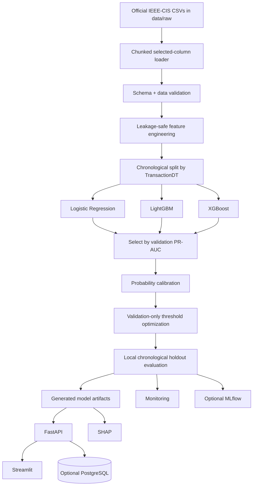
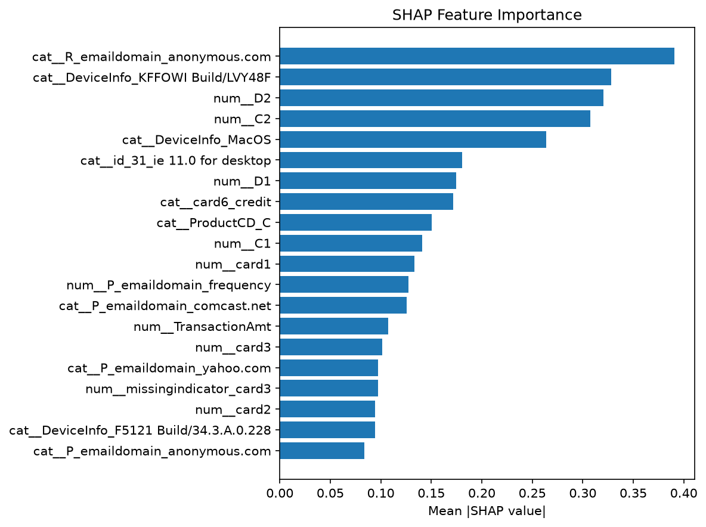

# Real-Time Fraud Risk Platform — IEEE-CIS Fraud Detection

Production-style Data Science / Machine Learning portfolio project built around the **official IEEE-CIS Fraud Detection dataset**. The repository contains source code, tests, SQL, API/dashboard code, monitoring utilities, verified reports, and Windows run instructions. The raw IEEE-CIS CSVs and generated model binaries are intentionally excluded from GitHub.

> **Portfolio/research system only. It is not a production banking fraud engine. Results below are LOCAL IEEE-CIS HOLDOUT RESULTS, not Kaggle leaderboard scores.**

## Problem Statement

Fraud detection is a highly imbalanced classification problem. A useful system must capture fraudulent transactions while limiting false positives that disrupt legitimate customers. This project therefore emphasizes PR-AUC, recall/fraud capture, precision, ROC-AUC, calibration, Brier score, false-positive rate, and a configurable business-cost threshold instead of raw accuracy.

## Architecture



## Key Features

- Real IEEE-CIS training data only; no bundled fake/sample fraud dataset
- Memory-efficient selected-column loading with chunked CSV parsing and early dtype optimization
- Safe `TransactionID` identity merge and train/test `id_01` vs `id-01` normalization
- Chronological validation using `TransactionDT`
- Logistic Regression baseline with sparse-friendly `saga` solver
- LightGBM and XGBoost candidates
- Model selection strictly by validation PR-AUC
- Probability calibration and Brier-score evaluation
- Validation-only business-cost threshold optimization
- Final local chronological holdout evaluation
- SHAP summary, global importance, and individual explanation
- FastAPI single/batch prediction with Swagger docs
- Streamlit scoring, model-performance, and monitoring pages
- Core PSI/KS monitoring independent of Evidently
- Optional PostgreSQL event persistence
- Optional MLflow experiment tracking
- Docker/Docker Compose support
- Pytest, Ruff, Black, and GitHub Actions

## Dataset

The raw IEEE-CIS dataset is **not included in this repository due to size/licensing/distribution considerations**. Obtain it separately and place the four official files here:

```text
data/raw/
├── train_transaction.csv
├── train_identity.csv
├── test_transaction.csv
└── test_identity.csv
```

Expected official shapes from the verified source data:

| File | Rows | Columns |
|---|---:|---:|
| `train_transaction.csv` | 590,540 | 394 |
| `train_identity.csv` | 144,233 | 41 |
| `test_transaction.csv` | 506,691 | 393 |
| `test_identity.csv` | 141,907 | 41 |

`train_transaction.csv` contains the target `isFraud`. The official competition test data does **not** contain `isFraud`; this project never creates a fake target for it.

The verified labeled dataset contained **20,663 fraud rows (3.499%)**, zero missing target values, and zero duplicate `TransactionID` values. For normal local training, the loader uses a documented subset of raw fields rather than materializing all 394 transaction columns in multiple DataFrame copies.

See [`data/README.md`](data/README.md) for placement details.

## Validation Strategy and Leakage Controls

Transactions are ordered by `TransactionDT`:

- oldest 70% → model training
- next 7.5% → probability calibration
- next 7.5% → validation metrics + threshold selection
- latest 15% → local held-out evaluation

Feature/preprocessing state is fitted only on the training history. Calibration and threshold optimization do not use the final holdout. The official unlabeled Kaggle test set is separate from all labeled evaluation.

## Model Selection

The verified full-data run selected the winner by **validation PR-AUC**:

| Model | Validation PR-AUC | Local holdout PR-AUC |
|---|---:|---:|
| Logistic Regression | 0.14756 | 0.14225 |
| **LightGBM** | **0.32967** | 0.3767068 |
| XGBoost | 0.31382 | **0.38462** |

**LightGBM remains the selected model.** XGBoost has the higher local-holdout PR-AUC, but changing the winner after observing the holdout would leak test-set information into model selection.

## LOCAL IEEE-CIS HOLDOUT RESULTS

Verified selected LightGBM results:

| Metric | Value |
|---|---:|
| PR-AUC | **0.3767068** |
| ROC-AUC | **0.8496966** |
| Precision | **0.7531194** |
| Recall / fraud capture | **0.2740837** |
| F1 | **0.4019025** |
| False-positive rate | **0.00323984** |
| Brier score | **0.0270360** |
| Frozen block threshold | **0.51** |
| TN / FP / FN / TP | **85,221 / 277 / 2,238 / 845** |
| Recall @ 1% FPR | **0.32955** |
| Precision @ 1% FPR | **0.55068** |

Selected calibration method: **sigmoid**.

Evidence is retained under `reports/metrics/`, `reports/figures/`, and `reports/model_report.md`.

## SHAP Explainability

The SHAP compatibility layer handles list/tuple outputs, 2-D arrays, 3-D binary-class arrays, and sparse matrices. Only the bounded explanation sample is densified when required.

Verified figures:

- `reports/figures/shap_summary.png`
- `reports/figures/shap_feature_importance.png`
- `reports/figures/shap_individual_transaction.png`



## Project Structure

```text
real-time-fraud-risk-platform/
├── .env.example
├── .github/workflows/
├── .gitignore
├── Dockerfile
├── docker-compose.yml
├── README.md
├── WINDOWS_RUNBOOK.md
├── requirements.txt
├── requirements-postgres.txt
├── requirements-evidently.txt
├── requirements-experiments.txt
├── pyproject.toml
├── configs/
├── data/
│   ├── README.md
│   ├── raw/.gitkeep
│   └── processed/.gitkeep
├── models/.gitkeep
├── notebooks/
├── reports/
│   ├── figures/
│   ├── metrics/
│   └── model_report.md
├── sql/
├── src/
│   ├── data/
│   ├── features/
│   ├── models/
│   ├── evaluation/
│   ├── explainability/
│   ├── monitoring/
│   └── database/
├── api/
├── app/
├── tests/
└── docs/
```

## Windows 11 / PowerShell Installation

```powershell
cd "C:\path\to\real-time-fraud-risk-platform"
python --version
python -m venv .venv
Set-ExecutionPolicy -Scope Process -ExecutionPolicy Bypass
.venv\Scripts\Activate.ps1
python -m pip install --upgrade pip
pip install -r requirements.txt
pip check
Copy-Item .env.example .env
python -c "from src.data.loader import load_training_data; print('IMPORT OK')"
```

Target environment: **Windows 11 + Python 3.14.x**. The final build environment used Linux/Python 3.13.5, so Windows/Python 3.14 runtime execution is documented but not falsely claimed as verified here.

## Training

After placing the four official CSVs in `data/raw/`:

```powershell
python -m src.models.train
```

The command trains Logistic Regression, LightGBM, and XGBoost, selects by validation PR-AUC, calibrates probabilities, optimizes the threshold on validation data, evaluates the frozen model on the local holdout, writes reports, generates SHAP outputs, and saves local artifacts under `models/`.

For debugging only, `--sample-size N` may read the first N rows of the **real IEEE-CIS CSVs**. It is not a synthetic-data mode and is not the normal portfolio training path.

## Prediction CLI

After training:

```powershell
python -m src.models.predict
```

Custom transaction example:

```powershell
python -m src.models.predict --amount 125.50 --product W --card1 12345 --card4 visa --device desktop
```

The probability, risk level, decision, threshold, and reason codes are model-derived; no prediction values are hard-coded.

## FastAPI

```powershell
uvicorn api.main:app --reload
```

Open:

- `http://localhost:8000/`
- `http://localhost:8000/health`
- `http://localhost:8000/docs`

Endpoints include:

```text
GET  /health
GET  /model/info
GET  /monitoring/status
POST /predict
POST /predict/batch
```

Model artifacts must exist first; run training before starting the API.

## Streamlit

Keep FastAPI running in one terminal, then in another:

```powershell
streamlit run app/streamlit_app.py
```

The dashboard does not require PostgreSQL or MLflow for core local use. Monitoring accepts user-supplied real CSV windows; no synthetic monitoring dataset is bundled.

## MLflow

```powershell
mlflow ui
```

Open `http://localhost:5000`. MLflow logging is optional; failure/unavailability must not prevent the core training pipeline from completing.

## PostgreSQL (Optional)

```powershell
pip install -r requirements-postgres.txt
docker compose up -d postgres
```

Then set `ENABLE_DATABASE=true` in `.env`. The core ML/API scoring path works with `ENABLE_DATABASE=false`.

## Evidently (Optional)

Core PSI/KS monitoring does not require Evidently. Optional install:

```powershell
pip install -r requirements-evidently.txt
```

If your exact Python 3.14 build is incompatible, leave `ENABLE_EVIDENTLY=false`.

## Docker (Optional)

Train the model first so `models/` contains local artifacts, then:

```powershell
docker compose config
docker compose up --build
```

Inside Docker, Streamlit uses `API_BASE_URL=http://api:8000`; container-to-container traffic never uses `localhost` for the API.

## Tests

With the real IEEE-CIS files present and model artifacts generated:

```powershell
pytest -v
```

Tests that require the private raw dataset or generated artifacts explicitly skip when those local resources are absent (for example on a public GitHub checkout) rather than silently substituting a fake dataset.

## GitHub Safety

The repository intentionally excludes:

- `.env`
- `.venv/`
- `data/raw/*.csv`
- `data/processed/*`
- generated `models/*`
- MLflow runtime state
- caches/logs/temp files/ZIPs

Before committing:

```powershell
git init
git add .
git status
```

Confirm raw IEEE CSVs, `.env`, `.venv`, and generated model binaries are not staged.

## Limitations

- Portfolio/research implementation, not a regulated production banking system
- Uses a memory-conscious raw-feature subset, not every IEEE-CIS field
- `TransactionDT` is relative time rather than a wall-clock timestamp
- Official competition test labels are unavailable; final evaluation uses a local chronological holdout from labeled training data
- Business-cost values and PSI thresholds are configurable project assumptions
- Full online behavioral state would require a production feature store/event stream
- Windows 11/Python 3.14, Streamlit UI, MLflow UI, PostgreSQL, and Docker require final local verification on the target machine where those services/tools are available

## Runbook

See [`WINDOWS_RUNBOOK.md`](WINDOWS_RUNBOOK.md) for the exact terminal-by-terminal Windows procedure.
# real-time-fraud-risk-platform

