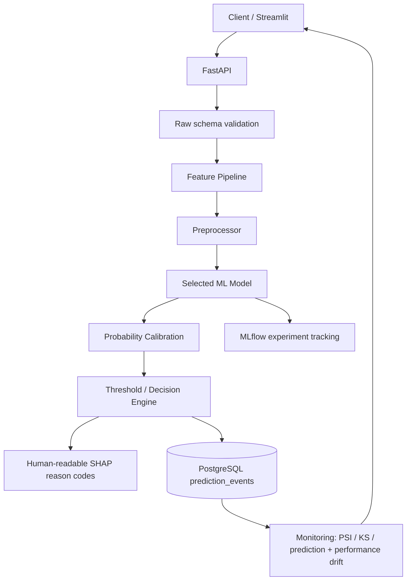

# Architecture

## Runtime flow

## Training flow
Raw IEEE-CIS CSVs are loaded with selected columns, validated, deduplicated, dtype-optimized and chronologically split by `TransactionDT`. The oldest 70% trains model/feature mappings. The next 15% is itself split chronologically: first half calibrates probability output, second half selects the business-cost block threshold. The newest 15% is untouched until final evaluation.

## Leakage controls
- No random split is used as primary validation.
- Train-only frequency/card statistics are learned by `FraudFeatureEngineer.fit`.
- Calibration and threshold optimization never use the final test set.
- SMOTE is intentionally not in the default production path. Any experiment must apply it only after temporal splitting, and only to training data.

## Serving consistency
`model.joblib` stores the feature engineering, preprocessing and classifier in one sklearn Pipeline. The API loads the exact pipeline generated by training, followed by the saved calibrator and validation-selected threshold.

## Online-history limitation
Several behavioral signals ideally require a feature store with state from prior events. In this portfolio implementation, train-only historical aggregates are learned from the training window and applied as lookup mappings. Device/email change flags are neutral in single-row inference. A production banking implementation should use low-latency online features.
